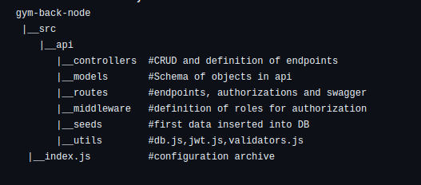
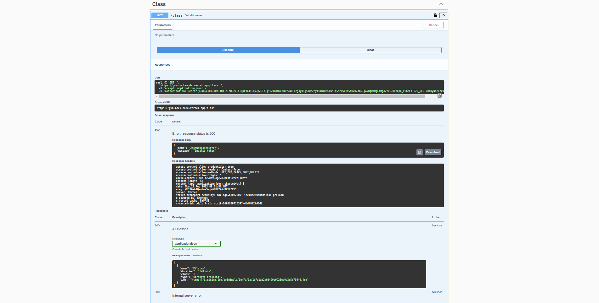

# Gym-web-back

Structure of API with Express.js and documentation with Swagger.

## Project structure

## Installation

- Clone this repository: 

        git clone https://github.com/AdrianaP00/Gym-back-node.git

- Inizialize the project: 

        cd gym-web-back
        npm install --save
        npm run start
        
- Go to the browser and use this URL for visualization of documentation: 

        https://gym-back-node.vercel.app/api-doc/

## Images

### Start

### Schemas

### LogIn and authorization

### Choose a role end take the token

### Put obtained token in Authorization 

### Let's start using the api!

